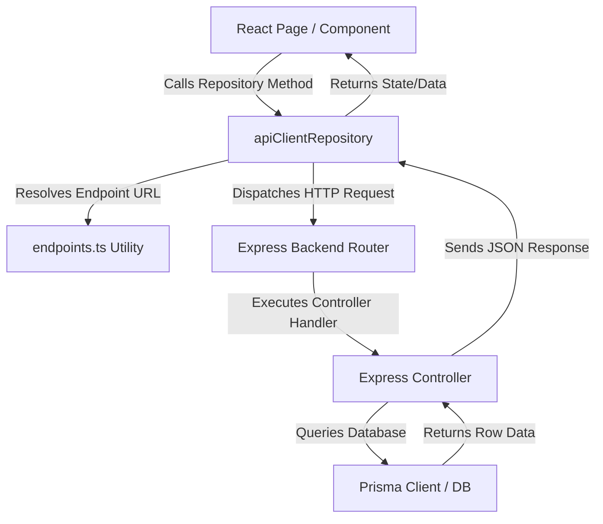

# API Architecture & Integration Guide

This guide details the standard procedure for creating new backend API endpoints and integrating them with the frontend application. It outlines the architectural layers, code structures, and files involved in both directions.

---

## File Locations & Directory Structure

To keep the codebase modular, clean, and consistent, always place files according to the following layout:

```text
ecom/
├── backend/
│   ├── prisma/
│   │   ├── schema.prisma          # Database Models & Schema
│   │   └── seed.ts                # Database Seeding script
│   └── src/
│       ├── app.ts                 # Express router declarations & CORS middlewares
│       ├── controllers/           # REST Handlers (Express controllers calling Prisma queries)
│       └── routes/                # REST Routers with OpenAPI/Swagger API documentation
└── frontend/
    └── src/
        ├── client/
        │   └── apiClient.ts       # Unified API client repositories (wraps fetch calls)
        ├── utils/
        │   └── endpoints.ts       # Centralized Backend API url paths
        ├── context/
        │   └── AdminContext.tsx   # React global Auth & Permission states
        ├── components/
        │   └── ui/                # Shared layout & UI shadcn components
        ├── data/
        │   └── *.ts               # Mock data & offline localstorage fallbacks
        └── pages/                 # UI Screens (Product, Category, Admin management views)
```

---

## Architecture Flow



---

## 1. Backend API Creation

When creating a new API entity (e.g., `brand`, `series`), follow this step-by-step structure in the `backend/` directory:

### Step A: Define Prisma Schema
Declare your entity model inside `backend/prisma/schema.prisma` if not already defined:
```prisma
model Series {
  id      String  @id @default(uuid())
  name    String  @unique
  slug    String  @unique
  logo    String?
  brandId String
  brand   Brand   @relation(fields: [brandId], references: [id], onDelete: Cascade)
}
```
Run `npx prisma generate` and `npx prisma db push` to synchronize changes with your database.

### Step B: Create Controller
Create a controller file under `backend/src/controllers/` (e.g., [seriesController.ts](file:///c:/Users/Parikshit/Desktop/workspace/ecom/backend/src/controllers/seriesController.ts)):
- Import Prisma Client.
- Implement Express handlers (`Request`, `Response`, `NextFunction`).
- Send responses in standard JSON format: `{ success: true, dataName: data }`.

```typescript
import { Request, Response, NextFunction } from "express";
import { PrismaClient } from "@prisma/client";

const prisma = new PrismaClient();

export const getSeries = async (req: Request, res: Response, next: NextFunction): Promise<void> => {
  try {
    const seriesList = await prisma.series.findMany({
      orderBy: { name: "asc" },
    });
    res.status(200).json({ success: true, series: seriesList });
  } catch (error) {
    next(error);
  }
};
```

### Step C: Define Express Routes
Define the routes under `backend/src/routes/` (e.g., [seriesRoutes.ts](file:///c:/Users/Parikshit/Desktop/workspace/ecom/backend/src/routes/seriesRoutes.ts)) and document them using **Swagger/OpenAPI** comments:
```typescript
import { Router } from "express";
import { getSeries, createSeries } from "../controllers/seriesController";

const router = Router();

/**
 * @swagger
 * /api/v1/series:
 *   get:
 *     summary: Get all series collections
 *     tags: [Series]
 *     responses:
 *       200:
 *         description: List of series collections
 */
router.get("/", getSeries);
router.post("/", createSeries);

export default router;
```

### Step D: Register Route in App Router
Import and register the router under the `api/v1` namespace inside [app.ts](file:///c:/Users/Parikshit/Desktop/workspace/ecom/backend/src/app.ts):
```typescript
import seriesRoutes from "./routes/seriesRoutes";

// ...
app.use("/api/v1/series", seriesRoutes);
```

---

## 2. Frontend API Integration

Once the backend endpoints are live, follow these steps to integrate them cleanly in the `frontend/` directory:

### Step A: Define Endpoints Constants
Define the endpoint path in [endpoints.ts](file:///c:/Users/Parikshit/Desktop/workspace/ecom/frontend/src/utils/endpoints.ts) to keep URLs centralized:
```typescript
export const ENDPOINTS = {
  // ...
  SERIES: `${BASE_URL}${API_PREFIX}/series`,
};
```

### Step B: Add Repository Method
Declare a CRUD repository object in [apiClient.ts](file:///c:/Users/Parikshit/Desktop/workspace/ecom/frontend/src/client/apiClient.ts) using the generic `request` wrapper:
```typescript
import { ENDPOINTS } from "../utils/endpoints";

export const seriesRepository = {
  getAll: async () => {
    return request<any>(ENDPOINTS.SERIES, { method: "GET" });
  },
  
  create: async (data: any) => {
    return request<any>(ENDPOINTS.SERIES, {
      method: "POST",
      body: JSON.stringify(data),
    });
  },
  
  update: async (id: string, data: any) => {
    return request<any>(`${ENDPOINTS.SERIES}/${id}`, {
      method: "PUT",
      body: JSON.stringify(data),
    });
  },
  
  delete: async (id: string) => {
    return request<any>(`${ENDPOINTS.SERIES}/${id}`, { method: "DELETE" });
  },
};
```

### Step C: Use Repository inside Pages / Components
Instead of using raw `fetch` or `axios` directly in React pages, import and call the relevant repository:
```tsx
import { useEffect, useState } from "react";
import { seriesRepository } from "@/client/apiClient";
import { toast } from "sonner";

export function SeriesManager() {
  const [seriesList, setSeriesList] = useState([]);

  useEffect(() => {
    const loadSeries = async () => {
      try {
        const data = await seriesRepository.getAll();
        if (data.success) {
          setSeriesList(data.series);
        }
      } catch (err) {
        toast.error("Failed to load series data.");
      }
    };
    loadSeries();
  }, []);

  const handleCreateSeries = async (newSeriesData) => {
    try {
      const data = await seriesRepository.create(newSeriesData);
      if (data.success) {
        setSeriesList((prev) => [...prev, data.series]);
        toast.success("Series created!");
      }
    } catch (err) {
      toast.error("Error creating series.");
    }
  };

  // ...
}
```
