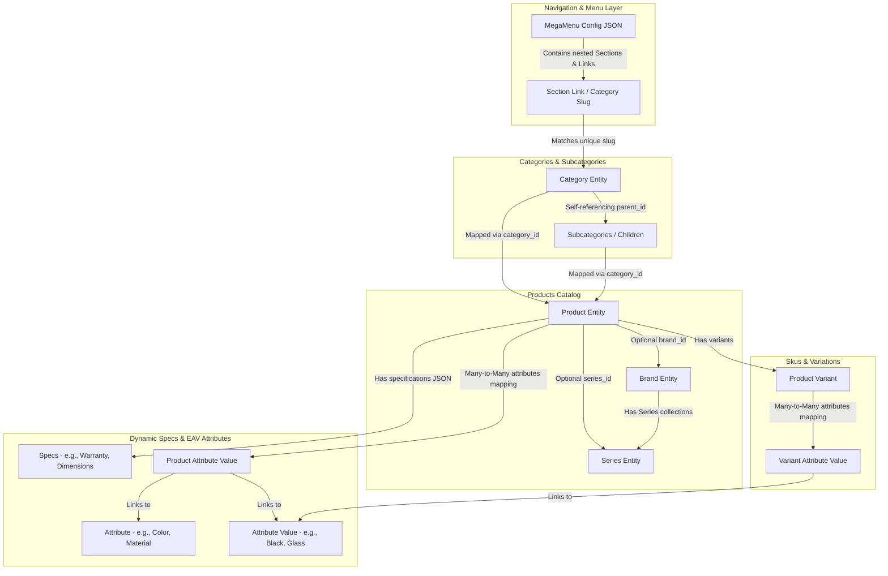
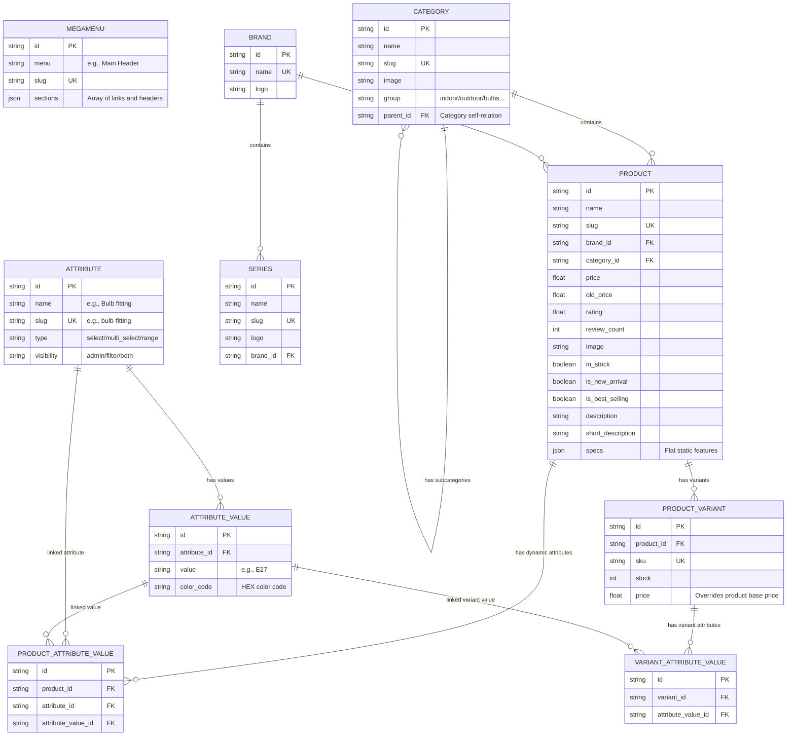

# E-Commerce Lighting Platform Architecture

## Overall Project Status (v0.0)

**Live:** [schipenster.com](https://schipenster.com) · **API:** [api.schipenster.com](https://api.schipenster.com) · **Deploy path:** `/opt/ecom`

### Completed

- [x] **Admin Panel & Architecture** — Node.js, Express, Prisma, PostgreSQL, Redis
- [x] **Dynamic Pages (CMS)** — UI blocks, hero banners, sliders, category carousels
- [x] **Rich Text Editor** — Shortcodes in dynamic pages without focus loss
- [x] **Category Multi-Select** — API-driven CMS category picker with search
- [x] **Shortcode Rendering Engine** — Mixed HTML + block shortcodes on storefront
- [x] **Storage / Media Library** — Folders, upload, rename, trash, grid/list view
- [x] **Swagger Documentation** — `/api-docs`
- [x] **Frontend Shop** — Customer storefront connected to live database
- [x] **Product Management** — Products, variants, brands, categories, EAV attributes
- [x] **Cart & Checkout** — Cart, wishlist, Stripe payments, order confirmation
- [x] **Order Management** — Admin orders, ready-to-ship, in-transit, delivered, returns
- [x] **User Authentication** — Customer + admin login, OTP, roles & permissions
- [x] **Mobile Responsive** — Storefront layout optimised for phones
- [x] **CI/CD (Jenkins)** — Deploy via `code-deploy` branch on VPS
- [x] **Admin Backups** — Database & uploads download from admin panel
- [x] **i18n** — Dutch / English storefront

### Pending

- [ ] **Sendcloud (live labels)** — Integration code exists; carrier labels blocked until Sendcloud billing, carrier contracts, and sender address are fully activated. See `docs/sendcloud_integration.md`.

### Docs

| Topic | File |
|-------|------|
| **VPS ops commands** (Docker, deploy, logs, disk) | `docs/vps_operations_runbook.md` |
| Production deploy | `docs/production_deployment_checklist.md` |
| Backup & restore | `docs/backup_restore_guide.md` |
| Sendcloud setup | `docs/sendcloud_integration.md` |
| Jenkins / CI-CD | `docs/v1.4-cicd-jenkins-plan.md` |

---

This document provides a visual walkthrough of the platform's catalog routing flow and database schema relationships.

---

## 1. Catalog & Navigation Flow

The following flowchart explains how a user navigates from the **Mega Menu** dynamic navigation configuration to **Categories**, **Products**, and down to their dynamic **Attributes/Specifications**.

---

## 2. Entity Relationship Diagram (ERD)

The database uses a relational database model (PostgreSQL) managed by Prisma. The dynamic filtering system is implemented using an **Entity-Attribute-Value (EAV)** pattern via `attributes`, `attribute_values`, and mapping tables.

---

## 3. Data Schema & Parameters Map

1. **Mega Menu Config**: Stored as a JSON array defining categories and section groupings. The frontend parses this configuration to build the dropdown menus dynamically.
2. **EAV dynamic attributes**:
   - `Attribute` holds the definition of a parameter (like *Material*, *IP Rating*).
   - `AttributeValue` holds the allowed values (like *Rattan*, *IP44*).
   - `ProductAttributeValue` links a specific `Product` to its selected `Attribute` and `AttributeValue`.
3. **Static Specifications**: Mapped as a JSON object `specs` on the `Product` model for flat, non-filterable details like *Warranty* and *Product Dimensions*.