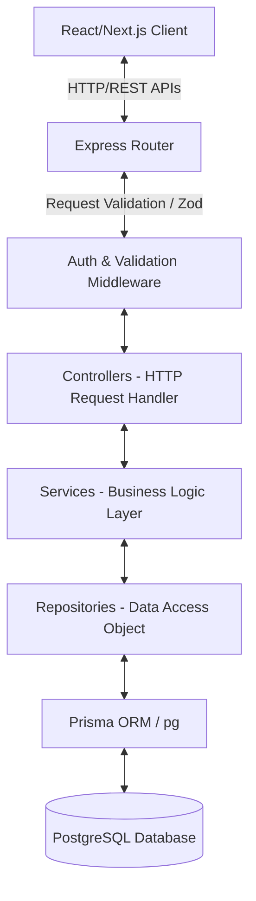
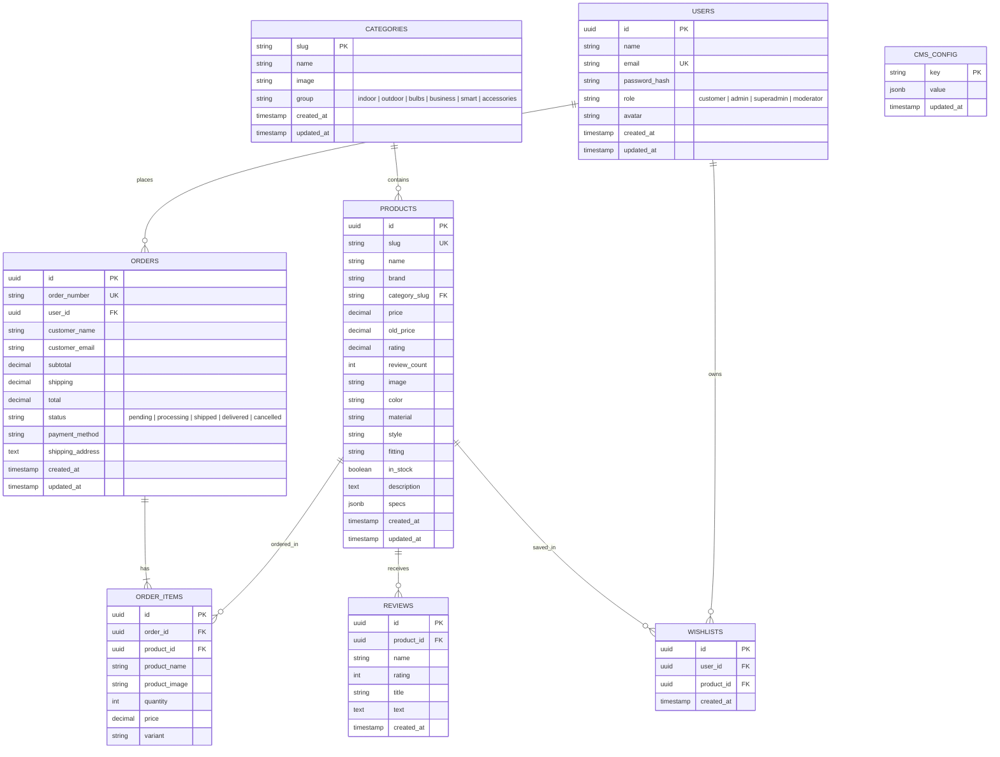

# E-Commerce Backend Implementation Plan

This document outlines the architecture, database design, API specifications, and step-by-step implementation plan for building a robust, enterprise-grade, and highly performant backend for our E-commerce store.

---

## 🏗️ 1. Architecture Overview

We will build a **Node.js** web server using **Express.js** and **TypeScript** following a clean, modular **Controller-Service-Repository** (layered) architecture pattern. This ensures separation of concerns, high testability, and scalability.



### Technology Stack
* **Runtime**: Node.js
* **Language**: TypeScript (fully typed interfaces, dtos, and safety)
* **Framework**: Express.js (fast, unopinionated, modular)
* **Database**: PostgreSQL (relational database for strict transactional consistency)
* **ORM**: Prisma ORM (provides type-safe queries, automatic migrations, and clean schema definition)
* **Authentication**: JWT (JSON Web Tokens) with standard cookies/headers + Bcrypt for password hashing
* **Validation**: Zod (schema validation for incoming HTTP payloads)
* **File Uploads**: Multer + Cloudinary (or Local Storage) for product/category images
* **Logging**: Winston + Morgan

---

## 🗄️ 2. PostgreSQL Database Schema

To support the shop, cart, checkout, admin portal, and CMS features in the React frontend, we design a relational schema with proper constraints, foreign keys, and indices.



### Table Definitions & SQL Schema

Here are the SQL scripts representing our PostgreSQL schema:

```sql
-- Enable UUID extension
CREATE EXTENSION IF NOT EXISTS "uuid-ossp";

-- 1. Users Table (Customers & Admins)
CREATE TABLE users (
    id UUID PRIMARY KEY DEFAULT uuid_generate_v4(),
    name VARCHAR(255) NOT NULL,
    email VARCHAR(255) UNIQUE NOT NULL,
    password_hash VARCHAR(255) NOT NULL,
    role VARCHAR(50) DEFAULT 'customer' CHECK (role IN ('customer', 'admin', 'superadmin', 'moderator')),
    avatar VARCHAR(255),
    created_at TIMESTAMP WITH TIME ZONE DEFAULT CURRENT_TIMESTAMP,
    updated_at TIMESTAMP WITH TIME ZONE DEFAULT CURRENT_TIMESTAMP
);

-- 2. Categories Table
CREATE TABLE categories (
    slug VARCHAR(100) PRIMARY KEY,
    name VARCHAR(255) NOT NULL,
    image VARCHAR(255) NOT NULL,
    "group" VARCHAR(100) NOT NULL CHECK ("group" IN ('indoor', 'outdoor', 'bulbs', 'business', 'smart', 'accessories')),
    created_at TIMESTAMP WITH TIME ZONE DEFAULT CURRENT_TIMESTAMP,
    updated_at TIMESTAMP WITH TIME ZONE DEFAULT CURRENT_TIMESTAMP
);

-- 3. Products Table
CREATE TABLE products (
    id UUID PRIMARY KEY DEFAULT uuid_generate_v4(),
    slug VARCHAR(255) UNIQUE NOT NULL,
    name VARCHAR(255) NOT NULL,
    brand VARCHAR(255) NOT NULL,
    category_slug VARCHAR(100) REFERENCES categories(slug) ON DELETE RESTRICT ON UPDATE CASCADE,
    price DECIMAL(10, 2) NOT NULL,
    old_price DECIMAL(10, 2),
    rating DECIMAL(2, 1) DEFAULT 0.0 CHECK (rating >= 0.0 AND rating <= 5.0),
    review_count INTEGER DEFAULT 0,
    image VARCHAR(255) NOT NULL,
    color VARCHAR(100),
    material VARCHAR(100),
    style VARCHAR(100),
    fitting VARCHAR(100),
    in_stock BOOLEAN DEFAULT TRUE,
    description TEXT NOT NULL,
    specs JSONB DEFAULT '{}'::jsonb,
    created_at TIMESTAMP WITH TIME ZONE DEFAULT CURRENT_TIMESTAMP,
    updated_at TIMESTAMP WITH TIME ZONE DEFAULT CURRENT_TIMESTAMP
);

-- 4. Reviews Table
CREATE TABLE reviews (
    id UUID PRIMARY KEY DEFAULT uuid_generate_v4(),
    product_id UUID NOT NULL REFERENCES products(id) ON DELETE CASCADE,
    name VARCHAR(255) NOT NULL,
    rating INTEGER NOT NULL CHECK (rating >= 1 AND rating <= 5),
    title VARCHAR(255) NOT NULL,
    text TEXT NOT NULL,
    created_at TIMESTAMP WITH TIME ZONE DEFAULT CURRENT_TIMESTAMP
);

-- 5. Orders Table
CREATE TABLE orders (
    id UUID PRIMARY KEY DEFAULT uuid_generate_v4(),
    order_number VARCHAR(100) UNIQUE NOT NULL,
    user_id UUID REFERENCES users(id) ON DELETE SET NULL,
    customer_name VARCHAR(255) NOT NULL,
    customer_email VARCHAR(255) NOT NULL,
    subtotal DECIMAL(10, 2) NOT NULL,
    shipping DECIMAL(10, 2) NOT NULL,
    total DECIMAL(10, 2) NOT NULL,
    status VARCHAR(50) DEFAULT 'pending' CHECK (status IN ('pending', 'processing', 'shipped', 'delivered', 'cancelled')),
    payment_method VARCHAR(100) NOT NULL,
    shipping_address TEXT NOT NULL,
    created_at TIMESTAMP WITH TIME ZONE DEFAULT CURRENT_TIMESTAMP,
    updated_at TIMESTAMP WITH TIME ZONE DEFAULT CURRENT_TIMESTAMP
);

-- 6. Order Items Table
CREATE TABLE order_items (
    id UUID PRIMARY KEY DEFAULT uuid_generate_v4(),
    order_id UUID NOT NULL REFERENCES orders(id) ON DELETE CASCADE,
    product_id UUID REFERENCES products(id) ON DELETE SET NULL,
    product_name VARCHAR(255) NOT NULL,
    product_image VARCHAR(255) NOT NULL,
    quantity INTEGER NOT NULL CHECK (quantity > 0),
    price DECIMAL(10, 2) NOT NULL,
    variant VARCHAR(100)
);

-- 7. Wishlists Table
CREATE TABLE wishlists (
    id UUID PRIMARY KEY DEFAULT uuid_generate_v4(),
    user_id UUID NOT NULL REFERENCES users(id) ON DELETE CASCADE,
    product_id UUID NOT NULL REFERENCES products(id) ON DELETE CASCADE,
    created_at TIMESTAMP WITH TIME ZONE DEFAULT CURRENT_TIMESTAMP,
    UNIQUE(user_id, product_id)
);

-- 8. CMS Configuration Table
CREATE TABLE cms_config (
    key VARCHAR(100) PRIMARY KEY,
    value JSONB NOT NULL DEFAULT '{}'::jsonb,
    updated_at TIMESTAMP WITH TIME ZONE DEFAULT CURRENT_TIMESTAMP
);

-- Indexes for performance optimization
CREATE INDEX idx_products_category ON products(category_slug);
CREATE INDEX idx_products_price ON products(price);
CREATE INDEX idx_orders_user ON orders(user_id);
CREATE INDEX idx_orders_status ON orders(status);
CREATE INDEX idx_wishlists_user ON wishlists(user_id);
CREATE INDEX idx_reviews_product ON reviews(product_id);
```

---

## 📡 3. API Endpoint Design

We will expose clear RESTful endpoints prefixed with `/api/v1`.

### 🔑 Authentication & Users
* `POST /api/v1/auth/register` - Create customer account
* `POST /api/v1/auth/login` - Authenticate customer, return JWT token (and cookie)
* `POST /api/v1/auth/admin-login` - Authenticate admin/moderator, check user roles
* `POST /api/v1/auth/logout` - Clear user session/cookies
* `GET /api/v1/auth/me` - Get current authenticated user profile
* `PUT /api/v1/auth/profile` - Update customer profile / password

### 🏷️ Categories & Products (Shop)
* `GET /api/v1/categories` - Fetch all categories
* `GET /api/v1/products` - Fetch products (with query params for search, sorting, category slug, brand, price-range, and inStock status)
* `GET /api/v1/products/featured` - Fetch top featured products
* `GET /api/v1/products/deals` - Fetch discounted products (sale)
* `GET /api/v1/products/:slug` - Fetch specific product detail by slug
* `GET /api/v1/products/:id/reviews` - Fetch reviews for a specific product
* `POST /api/v1/products/:id/reviews` - Submit a review (authenticated)

### 🛒 Wishlist
* `GET /api/v1/wishlist` - Get current user's wishlist (authenticated)
* `POST /api/v1/wishlist/:productId` - Add a product to the wishlist
* `DELETE /api/v1/wishlist/:productId` - Remove a product from the wishlist

### 📦 Orders & Checkout
* `POST /api/v1/orders` - Place a new order (supports guest checkout and registered user checkout)
* `GET /api/v1/orders/my-orders` - Fetch orders placed by the currently logged-in user
* `GET /api/v1/orders/:id` - Fetch details of a specific order (secured: user must own it or be an admin)

### 🛠️ Admin Panel (Role Protected: `admin`, `superadmin`, `moderator`)
* `GET /api/v1/admin/dashboard` - Get overall stats (revenue, order counts, customer counts, low stock warnings)
* `GET /api/v1/admin/products` - Fetch all products for admin list
* `POST /api/v1/admin/products` - Create a new product (with Zod validation)
* `PUT /api/v1/admin/products/:id` - Update a product (price, description, inStock status, inventory, etc.)
* `DELETE /api/v1/admin/products/:id` - Delete a product
* `GET /api/v1/admin/categories` - Categories management
* `POST /api/v1/admin/categories` - Create custom category
* `PUT /api/v1/admin/categories/:slug` - Update category details
* `DELETE /api/v1/admin/categories/:slug` - Delete category (with sub-product checks)
* `GET /api/v1/admin/orders` - List all system orders (with status filters)
* `PUT /api/v1/admin/orders/:id/status` - Update order status (`processing` -> `shipped` -> `delivered`, or `cancelled`)
* `GET /api/v1/admin/users` - Manage registered users & roles (e.g. promoting a user to moderator or admin)
* `PUT /api/v1/admin/users/:id/role` - Update user role (restricted to `superadmin`)

### 📺 CMS (Content Management System)
* `GET /api/v1/cms/:key` - Fetch website block configuration (e.g. homepage sliders, promo banner details, footer links)
* `PUT /api/v1/admin/cms/:key` - Update configuration block (role protected: `admin` and above)

---

## 🛠️ 4. Directory Structure

Inside `c:\Users\Parikshit\Desktop\workspace\ecom\backend`, we will organize the folder structure as follows:

```
backend/
├── src/
│   ├── config/             # DB & App Configurations (Database config, environment loader, constants)
│   │   ├── db.ts           # PostgreSQL client/Prisma instance
│   │   └── env.ts          # Zod-validated Environment Variables
│   ├── controllers/        # Express HTTP request handlers
│   │   ├── authController.ts
│   │   ├── productController.ts
│   │   ├── orderController.ts
│   │   ├── adminController.ts
│   │   └── cmsController.ts
│   ├── services/           # Reusable business logic layers
│   │   ├── authService.ts
│   │   ├── productService.ts
│   │   ├── orderService.ts
│   │   └── adminService.ts
│   ├── repositories/       # Direct DB CRUD operations using Prisma/pg
│   │   ├── userRepository.ts
│   │   ├── productRepository.ts
│   │   └── orderRepository.ts
│   ├── middlewares/        # Express Middlewares (Auth, Error handling, Logging, Validators)
│   │   ├── authMiddleware.ts
│   │   ├── errorMiddleware.ts
│   │   ├── roleMiddleware.ts
│   │   └── validationMiddleware.ts
│   ├── utils/              # Helper functions (JWT generators, password hashing, slugify)
│   │   ├── jwt.ts
│   │   ├── password.ts
│   │   └── logger.ts
│   ├── routes/             # App routers grouping endpoints
│   │   ├── authRoutes.ts
│   │   ├── productRoutes.ts
│   │   ├── orderRoutes.ts
│   │   ├── adminRoutes.ts
│   │   └── index.ts        # Main aggregator router
│   ├── app.ts              # Express App setup (CORS, JSON parsers, basic middlewares)
│   └── index.ts            # Server spin up
├── prisma/                 # Prisma configuration & migrations directory
│   └── schema.prisma       # Prisma data model definition file
├── dist/                   # Compiled Javascript (Production build output)
├── .env.example            # Environment variables placeholder
├── .env                    # Secret variables (Local ignored)
├── tsconfig.json           # TS Compiler configurations
└── package.json            # Dependencies & Scripts
```

---

## 🚀 5. Detailed Implementation Checklist

Here is our phase-wise development roadmap. Let's work systematically through these tasks to build a complete backend.

### Phase 1: Environment, Tooling & Initial Configuration
- [ ] Initialize NPM project inside `backend/` and configure standard scripts (`dev`, `build`, `start`, `lint`).
- [ ] Install dependencies (`express`, `cors`, `dotenv`, `pg`, `bcryptjs`, `jsonwebtoken`, `zod`, `multer`, `winston`).
- [ ] Install dev-dependencies (`typescript`, `@types/node`, `@types/express`, `@types/cors`, `@types/bcryptjs`, `@types/jsonwebtoken`, `ts-node-dev`, `prisma`).
- [ ] Initialize TypeScript configuration (`tsconfig.json`) with strict checks, path aliases, and build targets.
- [ ] Initialize Prisma ORM with PostgreSQL provider: `npx prisma init`.
- [ ] Write `schema.prisma` mappings representing the entire E-Commerce database model (Users, Categories, Products, Reviews, Orders, OrderItems, Wishlists, CMSConfig).
- [ ] Set up local `.env` and `.env.example` configurations containing `PORT`, `DATABASE_URL`, `JWT_SECRET`, `NODE_ENV`, `CLIENT_URL`.
- [ ] Perform the initial Prisma migration to create all schemas inside the local PostgreSQL database: `npx prisma migrate dev --name init`.

### Phase 2: Core Infrastructure, Utilities & Middlewares
- [ ] Set up the Express App foundation (`src/app.ts` & `src/index.ts`) with CORS, JSON body parser, request logger, and compression.
- [ ] Write environment variable validator using Zod (`src/config/env.ts`) to fail-fast if any key configuration is missing at startup.
- [ ] Write core Utilities:
  - [ ] Password hashing & checking using `bcryptjs` (`src/utils/password.ts`).
  - [ ] JWT token generation and verification using `jsonwebtoken` (`src/utils/jwt.ts`).
  - [ ] Application logger using `winston` and `morgan` (`src/utils/logger.ts`).
- [ ] Write core Middlewares:
  - [ ] Custom Global Error Handler (`src/middlewares/errorMiddleware.ts`) to return structured JSON errors instead of stack traces.
  - [ ] Request payload schema validator (`src/middlewares/validationMiddleware.ts`) leveraging Zod schemas.
  - [ ] Authentication Guard (`src/middlewares/authMiddleware.ts`) to parse, verify JWTs and attach the user to request contexts.
  - [ ] Role authorization Guard (`src/middlewares/roleMiddleware.ts`) to block non-admin accounts from modifying backend stores.

### Phase 3: Seeding & Seed Script
- [ ] Write a seed script (`prisma/seed.ts` or a database script) to parse mock data from our frontend lists (`products.ts`, `categories.ts`, `orders.ts`) and insert them into the PostgreSQL tables.
- [ ] Seed the DB with demo admin credentials (`super@lamp.com`, `admin@lamp.com`, `mod@lamp.com`) so the user can immediately log in and access the full suite of Admin panel functions.
- [ ] Run seed script and verify database population using Prisma Studio (`npx prisma studio`).

### Phase 4: Core Domain Development (Features)
- [ ] **Authentication Domain**:
  - [ ] Repositories, Services, and Controllers for `register`, `login`, `admin-login`, and `logout`.
  - [ ] Test auth routes using standard clients (endpoints for customer and admin).
- [ ] **Shop Catalog (Categories & Products) Domain**:
  - [ ] Category list endpoint (`GET /api/v1/categories`).
  - [ ] Product query endpoint supporting search, pagination, category filtering, price filtering (`GET /api/v1/products`).
  - [ ] Specific product search by slug (`GET /api/v1/products/:slug`).
  - [ ] Featured and deal categories (`GET /api/v1/products/featured`, `/products/deals`).
  - [ ] Read and create product reviews endpoints.
- [ ] **Wishlist Domain**:
  - [ ] GET / POST / DELETE operations on User wishlists.
- [ ] **Order Management Domain**:
  - [ ] Zod schema to validate order items and addresses.
  - [ ] Checkout Endpoint (`POST /api/v1/orders`) which deducts inventory, handles total calculation, creates the `Order` record, and returns detailed transaction receipt.
  - [ ] Active customer orders history (`GET /api/v1/orders/my-orders`).

### Phase 5: Administration & Content Control (CMS)
- [ ] **Admin Core Management**:
  - [ ] Dashboard analytics (`GET /api/v1/admin/dashboard`) returning critical stats like total revenue, order count, total user counts, and monthly sales charts using SQL aggregations.
  - [ ] Full CRUD endpoints for Products (Create, Update, Delete) with image upload bindings.
  - [ ] Full CRUD endpoints for Categories.
  - [ ] Order workflow management (Updating shipment states, canceling orders, updating statuses).
  - [ ] User directory management (Promoting/demoting accounts).
- [ ] **Dynamic CMS Blocks**:
  - [ ] CMS Key-Value bindings for dynamic frontend blocks (`GET /api/v1/cms/:key` and role-restricted `PUT /api/v1/admin/cms/:key`).

### Phase 6: Frontend Integration, Testing & Launch
- [ ] Enable CORS permissions matching the frontend URL.
- [ ] Write comprehensive integration documentation detailing exact endpoints, expected payload models, and response wrappers.
- [ ] Guide the frontend config update to substitute static mock data calls (`import { products } from "@/data/products"`) with dynamic HTTP service calls using `fetch` or `axios`.
- [ ] Perform end-to-end validation (signing up as customer, adding items to cart, completing checkout, logging in as admin, seeing order on admin list).
