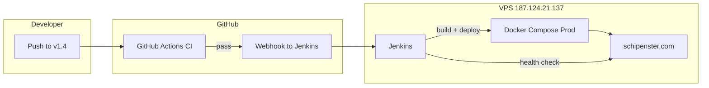

# v1.4 — CI/CD + Jenkins Implementation Plan

> **Branch:** `v1.4`  
> **Target server:** Hostinger VPS `187.124.21.137` → `/opt/ecom`  
> **Live domains:** `schipenster.com` / `api.schipenster.com`  
> **Status:** Plan only — implementation scheduled for next session

---

## 1. Goal

Manual deploy (`git pull` + `docker compose up --build`) ko replace karna automated pipeline se:

| Layer | Tool | Responsibility |
|-------|------|----------------|
| **CI** | GitHub Actions | Har push/PR pe lint, build, test — broken code merge na ho |
| **CD** | Jenkins (VPS pe) | `v1.4` (ya approved branch) pe auto/manual deploy + health check |

**End state:** Developer `v1.4` pe push kare → CI pass → Jenkins production pe deploy kare → health verify → success/fail notification.

---

## 2. Current Setup (baseline)

```
GitHub (BuckyBanaz/ecom)
        │
        ▼  manual SSH today
VPS /opt/ecom
  ├── docker-compose.prod.yml
  │     ├── postgres
  │     ├── redis
  │     ├── backend  (Node 20, Prisma migrate on start)
  │     ├── frontend (Vite → nginx)
  │     └── caddy    (SSL + reverse proxy)
  └── .env.production (secrets — NOT in git)
```

**Existing scripts:**
- Backend: `npm run build` (tsc), Docker multi-stage
- Frontend: `npm run build` (vite), `npm run lint`, `npm run test`
- Deploy today: `git pull origin v1.3 && docker compose -f docker-compose.prod.yml up -d --build backend frontend`

---

## 3. Architecture (target)



### CI vs CD split (recommended)

| | GitHub Actions | Jenkins |
|---|----------------|---------|
| Runs on | GitHub runners (free tier) | VPS (same machine as prod) |
| When | Every push + PR to `v1.4` | After CI pass OR manual button |
| Does | Lint, build, test, docker build dry-run | Pull code, rebuild images, restart containers, migrate, smoke test |
| Secrets | None production-critical | `.env.production`, SSH keys, domain |

---

## 4. Implementation phases (kal ka kaam)

### Phase A — Jenkins install on VPS (~30 min)

**Option A (recommended): Jenkins in Docker, host pe alag**

```bash
# /opt/jenkins/docker-compose.jenkins.yml
# Jenkins LTS + Docker socket mount (taaki Jenkins andar se docker compose chala sake)
```

- Port: `8080` (firewall se sirf tumhara IP ya VPN)
- Admin user + strong password
- Plugins install:
  - Git
  - GitHub Integration
  - Pipeline
  - Docker Pipeline
  - Credentials Binding
  - SSH Agent (optional)
  - Blue Ocean (optional UI)

**Option B:** Native Jenkins install — zyada setup, skip unless needed.

---

### Phase B — GitHub Actions CI (~45 min)

**File to create:** `.github/workflows/ci.yml`

**Triggers:**
```yaml
on:
  push:
    branches: [v1.4]
  pull_request:
    branches: [v1.4]
```

**Jobs:**

| Job | Steps |
|-----|-------|
| `frontend-ci` | `npm ci` → `npm run lint` → `npm run test` → `npm run build` (with dummy `VITE_API_URL`) |
| `backend-ci` | `npm ci` → `npx prisma generate` → `npm run build` |
| `docker-ci` (optional) | `docker build` backend + frontend — push nahi, sirf verify |

**Branch protection (GitHub settings):**
- `v1.4` pe merge se pehle CI green required

---

### Phase C — Jenkins pipeline (~1.5 hr)

**Files to create:**

| File | Purpose |
|------|---------|
| `Jenkinsfile` | Declarative pipeline (repo root) |
| `scripts/deploy.sh` | Idempotent deploy script |
| `scripts/health-check.sh` | Post-deploy smoke test |
| `docker-compose.jenkins.yml` | Jenkins container setup (VPS pe, repo ke bahar bhi OK) |

**Jenkinsfile stages:**

```
1. Checkout          → git fetch origin v1.4
2. Validate env      → .env.production exists on VPS (not from git)
3. Build images      → docker compose -f docker-compose.prod.yml build backend frontend
4. Deploy            → docker compose up -d backend frontend (zero-downtime-ish)
5. Migrate           → backend container: prisma migrate deploy (already in CMD, verify logs)
6. Health check      → curl https://api.schipenster.com/health
7. Notify            → console / email / Telegram (optional)
```

**`scripts/deploy.sh` sketch:**

```bash
#!/usr/bin/env bash
set -euo pipefail
cd /opt/ecom
git fetch origin v1.4
git checkout v1.4
git pull origin v1.4
docker compose -f docker-compose.prod.yml build backend frontend
docker compose -f docker-compose.prod.yml up -d backend frontend
./scripts/health-check.sh
```

**Jenkins credentials (Credential Store):**
- `github-ssh-key` — repo pull ke liye (deploy key)
- `env-production` — file credential pointing to `/opt/ecom/.env.production` (read-only mount)
- Never paste secrets in Jenkinsfile

---

### Phase D — GitHub ↔ Jenkins webhook (~20 min)

1. Jenkins job: **Multibranch Pipeline** ya **Pipeline** linked to `BuckyBanaz/ecom`, branch `v1.4`
2. GitHub webhook: `http://VPS_IP:8080/github-webhook/` (HTTPS reverse proxy better — Phase E)
3. Trigger rules:
   - Auto deploy: sirf `v1.4` push jab CI green ho
   - Manual: "Deploy to Production" button (parameter: `BRANCH=v1.4`)

**Safer flow (recommended for pehli baar):**
- CI auto on every push
- CD **manual approval** Jenkins mein — tum button dabao, tab deploy

---

### Phase E — Hardening (~45 min)

| Item | Action |
|------|--------|
| Secrets | `.env.production` sirf VPS pe; Jenkins file credential |
| Rollback | `scripts/rollback.sh` — previous git tag + `docker compose up` |
| DB safety | Deploy script mein `prisma migrate deploy` — **kabhi** `prisma db seed` production pe |
| Uploads | `backend_uploads` volume preserve — rebuild se data na ude |
| Jenkins URL | Caddy subdomain `jenkins.schipenster.com` + basic auth (optional) |
| Rate limit | Jenkins port public mat karo bina auth ke |
| Logs | Jenkins build log + `docker compose logs --tail=50 backend` on failure |

---

## 5. Files checklist (kal create karenge)

```
ecom/
├── .github/
│   └── workflows/
│       └── ci.yml                 ← NEW
├── Jenkinsfile                    ← NEW
├── scripts/
│   ├── deploy.sh                  ← NEW
│   ├── health-check.sh            ← NEW
│   └── rollback.sh                ← NEW (optional day 1)
├── docker-compose.jenkins.yml     ← NEW (VPS /opt/jenkins pe bhi OK)
└── docs/
    └── v1.4-cicd-jenkins-plan.md  ← this file
```

**No changes needed (already OK):**
- `docker-compose.prod.yml`
- `backend/Dockerfile`, `frontend/Dockerfile`
- `Caddyfile`

---

## 6. Day-by-day schedule (suggested)

### Day 1 — Kal (MVP pipeline)

| # | Task | Time |
|---|------|------|
| 1 | VPS pe Jenkins Docker setup | 30 min |
| 2 | GitHub Actions `ci.yml` + test push | 45 min |
| 3 | `Jenkinsfile` + `deploy.sh` + manual Jenkins job | 1.5 hr |
| 4 | Ek test deploy `v1.4` se | 30 min |
| 5 | Health check + site verify | 15 min |

**MVP done when:** Push to `v1.4` → CI green → Jenkins manual deploy → site live.

### Day 2 — Automation polish

- GitHub webhook auto-trigger
- Slack/Telegram notification
- Rollback script test
- Branch protection rules

### Day 3 — Optional advanced

- Staging environment (`staging.schipenster.com`)
- Docker image registry (GHCR) — build once, deploy pull
- Dependabot alerts fix (GitHub shows 7 high vulns)

---

## 7. Pre-requisites (kal se pehle verify)

- [ ] VPS SSH access stable (key added local machine pe)
- [ ] `/opt/ecom/.env.production` complete aur working
- [ ] `docker` + `docker compose` VPS pe installed
- [ ] GitHub repo admin access (webhooks + Actions enable)
- [ ] Domain DNS stable (Caddy SSL auto-renew OK)
- [ ] Backup: Postgres volume snapshot ya `pg_dump` routine

---

## 8. Risk & decisions (kal discuss)

| Question | Recommendation |
|----------|----------------|
| Auto deploy on every push? | **No** pehle week — manual approve; baad mein auto |
| CI fail pe deploy? | **Block** — Jenkins sirf CI success ke baad |
| `v1.3` production, `v1.4` dev? | **Yes** — `v1.4` test karo, stable hone pe `v1.4` → production branch |
| Jenkins same VPS as prod? | **Yes** for cost; alag VPS better for scale later |
| Database migrations in CD? | Already in backend CMD — deploy log monitor karo |

---

## 9. Success criteria

- [ ] PR/push to `v1.4` triggers GitHub Actions — all jobs green
- [ ] Jenkins "Deploy Production" one-click (ya webhook) works
- [ ] `https://api.schipenster.com/health` returns `healthy` post-deploy
- [ ] `https://schipenster.com` loads without white screen
- [ ] Failed build **does not** touch running containers
- [ ] Rollback procedure documented and tested once

---

## 10. Quick reference commands (after implementation)

```bash
# Manual deploy (fallback — jab Jenkins down ho)
cd /opt/ecom && git pull origin v1.4
docker compose -f docker-compose.prod.yml up -d --build backend frontend

# Health
curl -s https://api.schipenster.com/health | jq

# Jenkins logs
docker logs jenkins -f --tail 100

# Rollback
cd /opt/ecom && git checkout <previous-commit>
docker compose -f docker-compose.prod.yml up -d --build backend frontend
```

---

*Plan created for branch `v1.4`. Implementation starts next session.*
